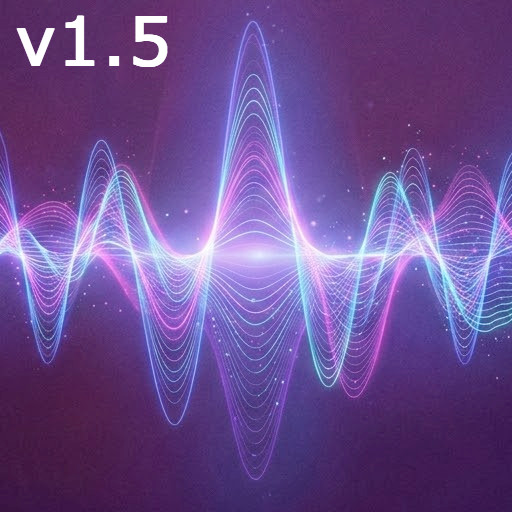

# Espectro Audio Generator Terminal by IrdurDev

  

---

## 🇺🇸 English

### 1. System Requirements & Compatibility
This tool is designed to be **universally compatible with any Macintosh system** (from vintage models to the latest versions) as long as [Python 3.x](https://www.python.org/downloads/) is installed.
* **Recommendation:** If you do not have Python installed, it is highly recommended to download the **latest stable version** from the official website.
* **Zero Dependencies:** A major advantage of this script is that it **does not require external libraries**. It runs entirely using Python's standard library, ensuring immediate execution.

### 2. Usage Interface
This is a **CLI (Command Line Interface)** tool. It operates exclusively through the terminal, ensuring low resource consumption and high performance on any Mac.

### 3. Purpose and Operation
The primary goal is to transform plain text into **spectral audio**. The output file contains no audible speech; instead, the text is encoded into the frequencies. The content is only visible when the audio is analyzed with a **spectrogram**.

---

## 🇪🇸 Español

### 1. Requisitos y Compatibilidad
Esta herramienta está diseñada para ser **universalmente compatible con cualquier sistema Macintosh** (desde modelos antiguos hasta los más recientes) siempre que tenga [Python 3.x](https://www.python.org/downloads/) instalado.
* **Recomendación:** Si no tienes Python instalado, se recomienda encarecidamente descargar e instalar la **última versión estable** desde el sitio web oficial.
* **Sin Dependencias:** Una de las grandes ventajas de este script es que **no requiere librerías externas**. Funciona íntegramente con la librería estándar de Python para una ejecución inmediata.

### 2. Interfaz de Uso
Esta es una herramienta de **línea de comandos (CLI)**. Se ejecuta exclusivamente a través de la terminal, lo que garantiza un consumo mínimo de recursos y un alto rendimiento en cualquier Mac.

### 3. Funcionamiento y Propósito
El objetivo principal es transformar texto plano en **audio espectral**. El archivo resultante no contiene voz; el texto se codifica en las frecuencias de modo que solo es visible al analizar el audio con un **espectrograma**.

---

## 📥 Downloads

* **[Access all versions here](https://github.com/IrdurDev/espectro-audio-generator-irdurdev/releases)** (Full release history)
* **[Latest Stable Version](https://github.com/IrdurDev/espectro-audio-generator-irdurdev/releases/latest)** (Recommended)

> **Note:** For the best experience, always download the version marked as **Latest**. And is currently experimental for Linux support only v1.5

---

## 📩 Support / Soporte

**Email:** [irdurdev@hotmail.com](mailto:irdurdev@hotmail.com)
