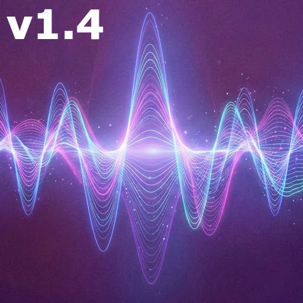

# Audio Spectral Text Encoder

---

## 🇪🇸 Español

### 1. Requisitos del Sistema
Para utilizar esta herramienta, es necesario tener instalado **Python 3.x.x**. Una de las grandes ventajas de este script es que **no requiere dependencias externas** (usa únicamente librerías estándar de Python), lo que facilita su ejecución inmediata sin instalaciones adicionales.

### 2. Interfaz de Uso
Esta es una herramienta diseñada exclusivamente para ser ejecutada a través de la **terminal o línea de comandos (CLI)**. No posee interfaz gráfica, lo que garantiza un consumo mínimo de recursos y facilidad de integración.

### 3. Funcionamiento y Propósito
El objetivo principal de esta utilidad es transformar texto plano en **audio espectral**. El audio resultante no contiene voz legible; el texto se codifica en las frecuencias de modo que solo es visible al analizar el archivo con un **espectrograma**.

---

## 🇺🇸 English

### 1. System Requirements
To use this program, you must have **Python 3.x.x** installed. A key feature of this script is that it **does not require external dependencies** (it uses only Python standard libraries), ensuring quick and easy setup.

### 2. Usage Interface
This tool is designed to be executed exclusively via the **terminal or command line (CLI)**. It does not have a graphical interface, making it lightweight and ideal for technical workflows.

### 3. Purpose and Operation
The primary goal of this utility is to convert plain text into **spectral audio**. The output sound file does not contain audible human speech; instead, the text is encoded into the frequencies so that it is only visible when the file is viewed through a **spectrogram**.

---

## ⚖️ Licencia y Derechos de Autor / License

**ES:** Todos los derechos reservados. Se permite el uso personal y profesional de esta herramienta "tal cual". **No se permite la distribución, modificación o comercialización del código fuente o sus derivados sin el permiso explícito del autor.**

**EN:** All rights reserved. Personal and professional use of this tool is allowed "as is". **Distribution, modification, or commercialization of the source code or its derivatives is not permitted without the explicit permission of the author.**

---

## 📩 Soporte / Support

Si tienes dudas o necesitas asistencia, puedes contactar a / If you have any questions or need assistance, feel free to contact:

**Email:** [irdurdev@hotmail.com](mailto:irdurdev@hotmail.com)
